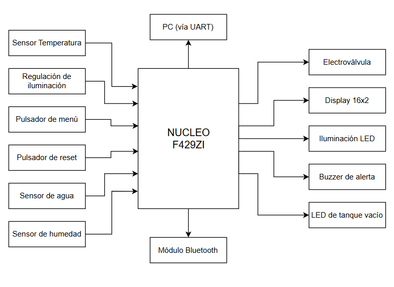
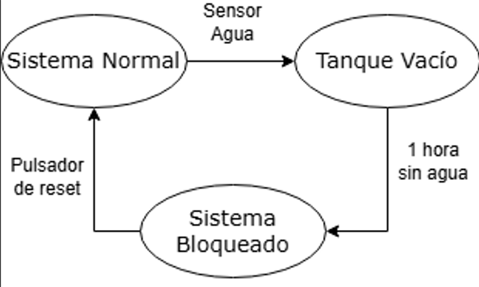
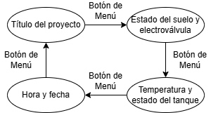

# Informe del Trabajo Final: Monitoreo Electrónico de Invernadero 

<picture>
    
</picture>

**Universidad de Buenas Aires**
**Facultad de Ingeniería**
**86.65 Sistemas Embebidos**

**Autor:** Wawryczuk, Laureano Agustin

**Padrón:** 102400

#### 1er Cuatrimestre 2025  

## Índice

- [Resumen](#resumen)
- [1 - Introducción](#1---introducción)  
  - [1.1 - Objetivo](#11---objetivo)
- [2 - Elección del proyecto](#2---elección-del-proyecto)  
  - [2.1 - Alcance del proyecto](#21---alcance-del-proyecto)
- [3 - Análisis de mercado y funcionalidades](#3---análisis-de-mercado-y-funcionalidades)  
  - [3.1 - Análisis de mercado](#31---análisis-de-mercado)  
  - [3.2 - Requerimientos](#32---requerimientos)  
  - [3.3 - Casos de Uso](#33---casos-de-uso)
- [4 - Desarrollo del sistema](#4---desarrollo-del-sistema)  
  - [4.1 - Hardware empleado](#41---hardware-empleado)  
  - [4.2 - Diagrama de bloques](#42---diagrama-de-bloques)  
  - [4.3 - Estructura del programa](#43---estructura-del-programa)  
  - [4.4 - Cumplimiento de requisitos](#44---cumplimiento-de-requisitos)  
  - [4.5 - Video final y repositorio](#45---video-final-y-repositorio)
- [5 - Conclusión](#5---conclusión)

## Resumen

En el presente informe se detallará el proceso de investigación previa, elección de funcionalidades y desarrollo de un sistema automático de monitoreo electrónico de un invernadero empleando una placa NUCLEO-F429ZI y periféricos acordes. 

Este sistema permite controlar los parámetros involucrados en el crecimiento y mantenimiento de las plantas (cantidad de luz, humedad del suelo y ciclos de riego) de forma autónoma, relegando tareas rutinarias al control electrónico e independizando al sistema del usuario, el cual sólo interactuará con el sistema para monitorear el estado del mismo y llenar el tanque de agua de ser necesario.

En comparación con los dispositivos existentes en mercado, este permite conexión remota via bluetooth para monitoreo y control de los parámetros asociados y la integración de un tanque de agua, el cual podría asociarse a fuentes de agua diferentes a la red.

## 1 - Introducción

### 1.1 - Objetivo
El dispositivo desarrollado tiene como objetivo proncipal independizar al sistema del usuario, permitiendo que éste pueda atender tareas de mayor importancia frente a controlar el estado de las plantación. Además, con este sistema el usuario puede dejar la plantación  sin su presencia durante períodos largos de tiempo sin que esto implique que se sequen o se marchiten las plantas.

## 2 - Elección del proyecto

### 2.1 - Alcance del proyecto  

El sistema será desarrollado utilizando la placa **NUCLEO-F429ZI**, incluyendo las siguientes funcionalidades:  

1. Control de electroválvula de riego monitoreando la humedad de suelo y la disponibilidad de agua en el tanque empleando un sensor N.O. al fondo del tanque que se cerrará si detecta agua.
2. Visualización del estado del sistema en un LCD.  
3. Interacción mediante un menú UART y Bluetooth para ajustar parámetros y verificar el estado del sistema.  
4. Pulsador para cambiar los datos mostrados en el Display.
5. LED de tanque vacío y buzzer de alarma ante ausencias de agua prolongadas.
6. Pulsador para apagar la alarma sonora al tener ausencia de agua.
7. Control de iluminación para independizar al sistema de la luz solar.

## 3 - Análisis de mercado y funcionalidades

### 3.1 - Análisis de mercado

[RIEG20](https://www.mercadolibre.com.ar/regador-automatico-con-temporizador-gadnic-amplia-aplicacion-color-blanco/p/MLA35355975?highlight=true&searchVariation=MLA35355975&headerTopBrand=true#polycard_client=search-nordic&searchVariation=MLA35355975&wid=MLA2081759612&position=14&search_layout=grid&type=product&tracking_id=ebd19cd4-d13a-406d-aa17-b2a83fbba3ac&sid=search)

[Hunter Xcore4](https://www.mercadolibre.com.ar/kit-de-riego-automatico-hunter-xcore4-con-electrovalvula-pgv100-y-boquilla-psu-04-17a-hunt-kit-programador-psu-17a-25/p/MLA41746686?highlight=false&headerTopBrand=false#polycard_client=search-nordic&searchVariation=MLA41746686&wid=MLA1496301901&position=5&search_layout=grid&type=product&tracking_id=ebd19cd4-d13a-406d-aa17-b2a83fbba3ac&sid=search)

[HTV13FRF](https://articulo.mercadolibre.com.ar/MLA-2018382592-programador-1-zona-hub-wifi-alexa-google-home-rain-point-_JM?variation=182950089014#reco_item_pos=3&reco_backend=pdp_pads_right_rars_v2_with_default&reco_backend_type=low_level&reco_client=pdp-pads-right&reco_id=8a0557be-7f26-4d3f-ac53-82f6e7b6e29c&reco_model=rk_ent_v2_retsys_ads&is_advertising=true&ad_domain=PDPDESKTOP_RIGHT&ad_position=4&ad_click_id=NjcyNGNhOGYtMmQ3Zi00YjA1LTk2YTEtYTk3NzMyYjExMjI3)

Se analizan tres opciones de controladores para sistemas de tratamiento.

| Característica |  RIEG20 | Hunter Xcore4| HTV13FRF|
|----------------|-----------------|---------|----------------------|
|Pantalla LCD|No|Sí|No|
|Conexión Wireless|No|No|Sí|
|Tanque de agua|No|No|No|
|RTC|No|Sí|No|
|Batería|Sí|No|Sí|
|Control de luz|No|No|No|
|precio|US$18|US$435|US$110|

Nota: Los precios se muestran en dolares.

### 3.2 - Requerimientos  

A continuación, se enumeran los requerimientos del sistema:  

#### **Luz**  

| Req ID | Descripción |  
|--------|-------------|  
| 1.1    | El sistema deberá poseer un control de iluminación preseteable para mantener un flujo lumínico constante sobre la planta. |  
| 1.2    | El control de la intensidad lumínica debe ajustarse empleando un potenciómetro. |  

#### **Agua**  

| Req ID | Descripción |  
|--------|-------------|  
| 2.1    | El sistema tendrá integrado un tanque de agua para el riego. |  
| 2.2    | El tanque dispondrá de un sensor de agua para avisar al usuario que el sistema se quedó sin agua, emitiendo alerta sonora y lumínica|  
| 2.3    | El sistema empleará una electroválvula para el control del riego. |  

#### **Modo de operación**  

| Req ID | Descripción |  
|--------|-------------|  
| 3.1    | El sistema operará de forma automática midiendo parámetros del recinto y ajustando las condiciones acorde a la configuración |
| 3.2    | En caso de ausencia de agua el sistema lo indicará al usuario y si ésta persiste bloqueará el sistema hasta que el agua se rellene y se presione el pulsador de reset |  

#### **Display**  

| Req ID | Descripción |  
|--------|-------------|  
| 4.1    | El Display mostrará en pantalla 4 menúes que indicarán el estado del sistema y podrá cambiarse entre ellos utilizando un pulsador de Menu |  
| 4.1.1  | -  El primer menú indicará el nombre del sistema.|
| 4.1.2  | -  El segundo mostrará los datos del suelo y del sistema de riego.|
| 4.1.3  | -  El tercero mostrará los datos de temperatura y estado del tanque (lleno o vacío).|
| 4.1.4  | -  El cuarto mostrará el día y la hora configuradas.|
| 4.2    | Si el sistema se queda sin agua durante un tiempo prolongado el Display indicará que el sistema está bloqueado.|

#### **Configuración**
| Req ID | Descripción |  
|--------|-------------|  
| 5.1    | Empleando el módulo bluetooth podrán configurarse los parámetros del sistema. | 

#### **Protocolo UART**
| Req ID | Descripción |  
|--------|-------------|  
| 6.1    | El sistema empleará el protocolo UART para mostrar todos los parámetros del sistema. |
  
#### **Alimentación**
| Req ID | Descripción |  
|--------|-------------|  
| 7.1    | El sistema debe operar con una fuente conmutada de 12V 1A. |

### 3.3 - Casos de Uso  

A continuación, se detallan algunos casos de uso:  

| Elemento del caso de uso | Definición |  
|---------------------------|------------|  
| **Disparador**           | El usuario desea cambiar de menú. |  
| **Precondición**          | El sistema no está bloqueado. |  
| **Flujo básico**          | La información del display cambia con el pulsador. |  

| Elemento del caso de uso | Definición |  
|---------------------------|------------|  
| **Disparador**           | El usuario quiere configurar los parámetros por Bluetooth. |  
| **Precondición**          | El sistema no está bloqueado. |  
| **Flujo básico**          | El sistema toma los datos enviados y los guarda. | 

| Elemento del caso de uso | Definición |  
|---------------------------|------------|  
| **Disparador**           | El suelo se encuentra seco. |  
| **Precondición**          | El tanque posee agua para regar. |  
| **Flujo básico**          | Se abre la electroválvula hasta obtener el nivel de humedad configurado. |  

| Elemento del caso de uso | Definición |  
|---------------------------|------------|  
| **Disparador**           | El sistema se quedó sin agua por una hora. |  
| **Precondición**          | Tanque de agua vacío. |  
| **Flujo básico**          | El sistema se bloquea. |  

| Elemento del caso de uso | Definición |  
|---------------------------|------------|  
| **Disparador**           | El usuario quiere desbloquear el sistema presionando el pulsador de reset. |  
| **Precondición**          | Sistema bloqueado. |  
| **Flujo básico**          | El sistema se desbloquea manteniendo el led de falta de agua encendido. |  

## 4 - Desarrollo del sistema

### 4.1 - Hardware empleado

Para medir los parámetros e interactuar con los usuarios se emplean los siguientes dispositivos:

| Elemento | Función | Costo | 
|---------------------------|-----------|-----------------|  
| Display LCD 16x2 + interfaz I2C | Mostrar mensajes al usuario | US$7.3 |
| 2 x Pulsadores | Interactruar con el usuario | US$0.7 |
| LM35 | Medición de temperatura | US$3 |
| Sensor de humedad de suelo capacitivo | Medición de humedad del suelo | US$2.3 |
| Sensor de agua en tanque | Verificación de presencia de agua en el tanque | US$8.7 |
| 2xTIP122 | Control de Electroválvula y Lámpara | US$7.3 |
| Buzzer | Indicar ausencia de agua | US$2.2 |
| LED | Indica que el tanque está vacío | US$0.5 |
| HC-06 | Comunicación bluetooth | US$4.4 |
| NUCLEO F429ZI | Controlador | US$115 |

**Costo total del proyecto:** US$151.4

### 4.2 - Diagrama de bloques  

Se presenta a continuación el diagrama en bloques del sistema:  

### 4.3 - Estructura del programa

El sistema tendrá dos máquinas de estado finitas integradas, una asociada al estado del tanque y otra asociada al mensaje mostrado en pantalla por el display. 
La primer máquina cambiará su estado acorde al estado del tanque:

En el primer estado, el sistema permite al usuario interactuar libremente con el sistema; en el segundo estado el sistema envía un alerta visual (LED encendido) indicando ausencia de agua e impide el riego del suelo; finalmente en el tercer estado el sistema se bloquea indicando mediante un buzzer que no puede continuar funcionando por falta de agua y enviandop a todas las interfaces esta información. Se podrá desbloquear el sisterma presionando el pulsador de "Reset"

La segunda máquina de estados solo funcionará cuando el sistema no esté bloqueado, permitiendo saltar entre estados con el pulsador de "Menú"

En el primer estado el sistema indicará por display el nombre del proyecto "SISTEMA DE RIEGO AUTOMÁTICO"; en el segundo mostrará el estado del tanque y de la electroválvula de riego; en el tercero monitorea la temperatura y el estado del tanque; mientras que en el cuarto muestra la hora y fecha actual.

El sistema tiene integrada comunicación via USART con la computadora y via Bluetooth para monitoreo de datos, para amos casos se muestran los datos de los periféricos del sistema y el estado general del mismo. Es una extensión al display LCD y permite además configurar la hora y fecha del sistema.

### 4.4 - Cumplimiento de requisitos

#### **Luz**  

| Req ID | Descripción | Estado | 
|--------|-------------|--------|  
| 1.1    | El sistema deberá poseer un control de iluminación preseteable para mantener un flujo lumínico constante sobre la planta. | 🟢 |  
| 1.2    | El control de la intensidad lumínica debe ajustarse empleando un potenciómetro. | 🟢 |  

#### **Agua**  

| Req ID | Descripción | Estado |  
|--------|-------------|--------|  
| 2.1    | El sistema tendrá integrado un tanque de agua para el riego. | 🟢  |  
| 2.2    | El tanque dispondrá de un sensor de agua para avisar al usuario que el sistema se quedó sin agua, emitiendo alerta sonora y lumínica| 🟢 |  
| 2.3    | El sistema empleará una electroválvula para el control del riego. | 🟢 |  

#### **Modo de operación**  

| Req ID | Descripción | Estado |  
|--------|-------------|--------|  
| 3.1    | El sistema operará de forma automática midiendo parámetros del recinto y ajustando las condiciones acorde a la configuración | 🟢 |
| 3.2    | En caso de ausencia de agua el sistema lo indicará al usuario y si ésta persiste bloqueará el sistema hasta que el agua se rellene y se presione el pulsador de reset | 🟢 | 

#### **Display**  

| Req ID | Descripción | Estado |  
|--------|-------------|--------|  
| 4.1    | El Display mostrará en pantalla 4 menúes que indicarán el estado del sistema y podrá cambiarse entre ellos utilizando un pulsador de Menu | 🟢 | 
| 4.1.1  | -  El primer menú indicará el nombre del sistema.| 🟢 |
| 4.1.2  | -  El segundo mostrará los datos del suelo y del sistema de riego.| 🟢 |
| 4.1.3  | -  El tercero mostrará los datos de temperatura y estado del tanque (lleno o vacío).| 🟢 |
| 4.1.4  | -  El cuarto mostrará el día y la hora configuradas.| 🟢 |
| 4.2    | Si el sistema se queda sin agua durante un tiempo prolongado el Display indicará que el sistema está bloqueado.| 🟢 |

#### **Configuración**
| Req ID | Descripción | Estado |  
|--------|-------------|--------|  
| 5.1    | Empleando el módulo bluetooth podrán mostrarse los parámetros del sistema. | 🟢 |

#### **Protocolo UART**
| Req ID | Descripción | Estado |  
|--------|-------------|--------|  
| 6.1    | El sistema empleará el protocolo UART para mostrar y configurar parámetros del sistema. | 🟢 |
  
#### **Alimentación**
| Req ID | Descripción | Estado |  
|--------|-------------|--------|  
| 7.1    | El sistema debe operar con una fuente conmutada de 12V 1A. | 🟢 |

### 4.5 - Video final y repositorio

A continuación se muestran el video final del sistema funcionando y el repositorio donde se encuentra todo lo correspondiente al software del proyecto:

Video del sistema: [Sistema de Riego Automático](https://drive.google.com/file/d/1rl8nGWudtGlgNvqPIWfrOqiguwOLjSJ-/view?usp=sharing)

Repositorio: [Repositorio de Github](https://github.com/Laureano1997/TP2/tree/TP_Final)

## 5 - Conclusión

El desarrollo del sistema de monitoreo electrónico para invernaderos permitió integrar distintas tecnologías embebidas con el objetivo de automatizar el cuidado de las plantas. Se logró diseñar un dispositivo funcional, autónomo y configurable que reemplaza tareas rutinarias como el control de riego e iluminación, asegurando el bienestar del cultivo incluso en ausencia del usuario. Además, se incorporaron interfaces de comunicación amigables como Bluetooth y UART, ampliando la usabilidad del sistema. El proyecto cumplió con todos los requerimientos establecidos, demostrando la viabilidad técnica de su implementación y su potencial para ser escalado o mejorado en futuras versiones.
